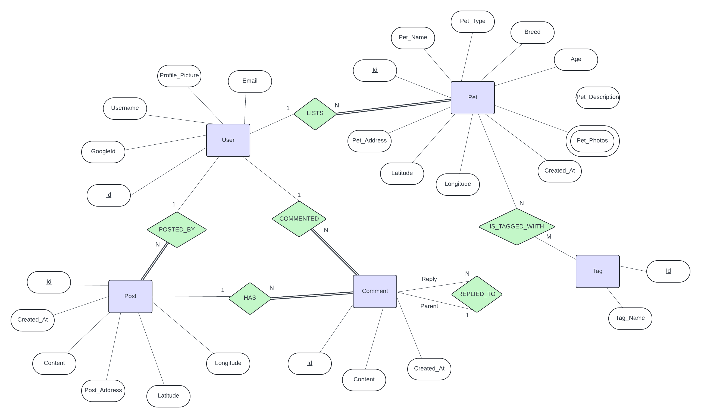

# Purrfect Neighbors API

CPSC-2650-M01 Full Stack Web Development II Final Project

## Team Ushuaia

- Yujie Peng
- Shushama Tahsin
- Yuna Hu

## Repository Links

### Link to purrfect-neighbors repository:

[https://github.com/yunahu/purrfect-neighbors](https://github.com/yunahu/purrfect-neighbors)

### Link to purrfect-neighbors-api repository:

[https://github.com/yunahu/purrfect-neighbors-api](https://github.com/yunahu/purrfect-neighbors-api)

## How to run this application locally

1. Clone this repository.
2. Create a `.env` file containing the sample structure below at the root of the directory
3. Ensure you have a Redis server running.
4. Run `docker-compose build`.
5. Run `docker-compose up`.
6. Run [purrfect-neighbors](https://github.com/yunahu/purrfect-neighbors) (Please refer to its own readme file.)

### Environmental Variables

    PORT=
    GOOGLE_CLIENT_ID=your_google_client_id.apps.googleusercontent.com
    GOOGLE_CLIENT_SECRET=your_google_client_secret

    SECRET=your_secret_key

    FRONTEND_URI=

    DB_HOST=your-rds-endpoint.amazonaws.com
    DB_USER=your_db_user
    DB_PASS=your_db_password
    DB_NAME=your_db_name

## Notes on Wireframe

### Figma Link

[Figma](https://www.figma.com/design/QsUcYGZT5ObdCgxm2kNXPY/Purrfect-Neighbors?node-id=2-493&t=jj49mporGUKubkRt-1)

### Base Layout:

- **Sidebar**: Navlinks to each page
- **Header**: Quick search and user login status
- [Page **Content**]
- **Footer**  


### Pages:

- **Homepage**
  - Search and Filter
  - Map, with markers for adoptable pets and pet products:
    - Click to open a popup with more information
    - Click the popup to view the details page
- **Pet Details**
  - Pet bio(image, description, attributes)
  - Contact
- **Product Details**
  - Product Post
  - Comment input
  - Comments List
- **Share Items**
  - Post Form to share pet products
- **User Profile**
  - User Information
  - Edit Profile
  - Manage Posts and Comments
- **Login**
  - Login Form (currently supports Google Login)

### Entity-Relationship Diagram (ERD):



### Database Setup

- **Schema Setup**: The MySQL database schema was defined to include tables for users, pets, pet photos, tags, pet tags, posts, and comments
- **Setup Script**: A setup script (`setup.js`) was created to initialize the database schema.
- **AWS RDS**: The MySQL database was set up on AWS RDS.
- **Database Connection**: Code was set up to connect to the AWS RDS instance using the credentials specified in the `.env` file.

### How to Setup

1. **Environment Variables**: Ensure the `.env` file contains the correct database credentials as specified above.
2. **Running the Setup Script**: Execute the setup script to create the tables in the database (only the first time):
   ```bash
   npm run setup
   ```

## Notes on Google Login

### Authentication Flow

1. **Login Endpoint**: Users initiate Google login via `/login/federated/google`.
2. **Google Callback**: Google redirects to `/oauth2/redirect/google` after authentication.
3. **Verify and Handle User Data**: Passport's Google Strategy handles user authentication by verifying the user's Google profile and either creating a new user or retrieving an existing user from the database.
4. **Session Creation**: On successful authentication, a session is created and stored in Redis.
5. **Serialization**: The user ID is serialized and stored in the session cookie.
6. **Deserialization**: For each subsequent request, the user ID is deserialized from the session cookie to retrieve the full user details from the database, maintaining the user's logged-in state.

### Session Management

- **Express Session**: Sessions are managed using express-session to maintain user login state across requests.
- Sessions are configured with a secret key (SECRET), and the session is stored in **Redis** for persistence.
- **Passport** is used for the serialization and deserialization of user information.
